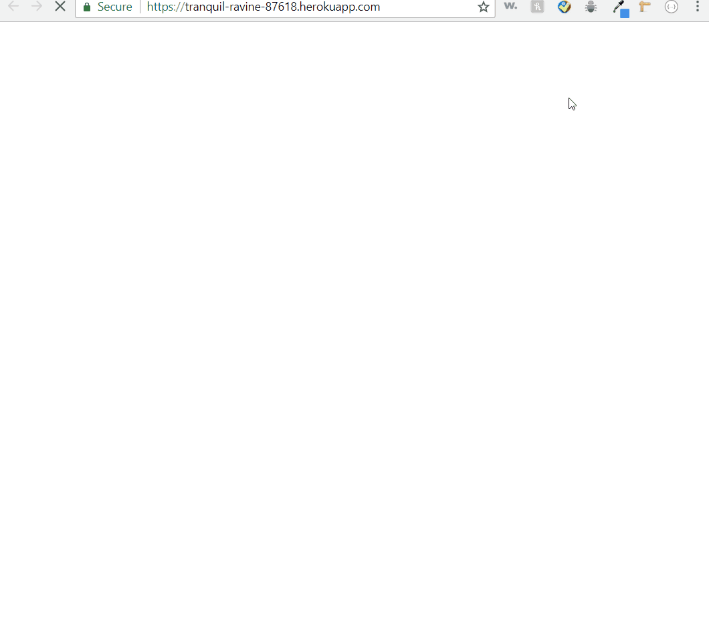

# Eat Da Burger!

## What is it?

This is a restaurant app that lets users input the names of burgers they'd like to eat. The user can create any burger name to add it to the menu. This also adds the new burger entry into the MySQL database. The user also may devour any burger by clicking on the button, which moves it into the column below and updates its status accordingly in the database.

## How to use it

* Uers can link to the homepage [Eat Da Burger](https://tranquil-ravine-87618.herokuapp.com/) without any registration.

* Once the user link in, they can submits a burger's name, the app will display the burger on the top side of the page -- Burgers are ready!.

* Each burger in the ready area also has the `Eat it!` button. When the user clicks it, the burger will move to the lower side of the page.

## Functionality

Eat Da Burger mainly build by MySQL, Node, Express, Handlebars and a homemade ORM. The app has 3 basic CRUD functions:

1. READ all the database from MySQL and show them to the DOM by using Handlebase.

2. UPDATE a selected burger by clicking the `Eat it!` button, which it will hit `/api/burgers/:id` route in Express to change the status in the MySQL database, and re-routes the page back to the `index` page.

3. CREATE a new burger by using the form, which it will hit `/api/burgers` route in Express to insert a new burger into the MySQL database, also will re-routes the page back to the `index` page. Then, the burger is now ready to be eaten.

## Screen Shots

### Homepage

## Technologies used 
- [Express-handlebars](https://www.npmjs.com/package/express-handlebars-sections)
- [Node.js](https://nodejs.org/en/)
- [Express NPM package](https://www.npmjs.com/package/express)
- [path NPM package](https://www.npmjs.com/package/path)
- [body parser json package](https://www.npmjs.com/package/body-parser-json)
- [Heroku](https://www.heroku.com/platform)
- [morgan](https://www.npmjs.com/package/morgan)
- [Bootstrap](https://getbootstrap.com/)